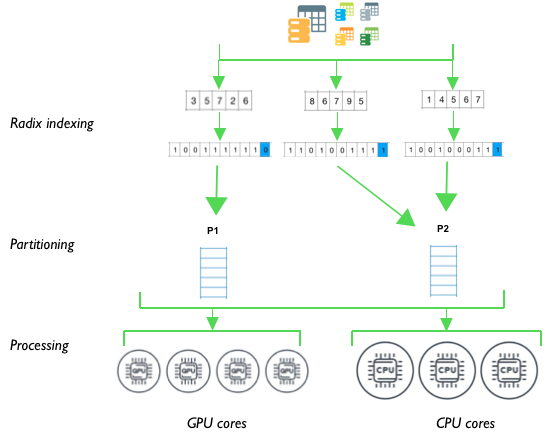

# Cross-device-CPU-GPU-transaction-processing

The conceptual diagram below depicts the project conceptual design having 2 phases; hash build and hash join. Both phases have a router operator which is an additional component to  the  system  in  order to  perform  simultaneous tasks which  is  expected to  improve  the  system’s  overall time efficiency. Router operator would be receiving the data from DBMS as data tables, then partitions will be created and delivered to CPUs and GPUs for concurrent processing.

Radix partitioning was applied on the data relations, taking into account cache memory available. After that hash tables will be build and probed subsequently.

**Radix Partitioning:**

- The data relations should be split equally based on the number of threads that will be used.
- For each tuple, the radix index should be determined. In order to do this, the key attribute should be observed, and from it the least significant bit can be selected as the radix index.
- Once the tuples are grouped by their corresponding radix index, the prefix sum should be calculated, and therefore the required offsets can be set on the output array, so that each thread knows the partition of the output that corresponds to it. On this design, prefix sum won't be implemented, since it is not part of the criteria that will be evaluated on this study.
- On this step, all threads in parallel place tuples on their respective positions of the output array ordered by radix index. This way parallelism can be achieved.
- Each radix index corresponds to a partition, so after this each partition of data can be delivered to the hash build process.

 
